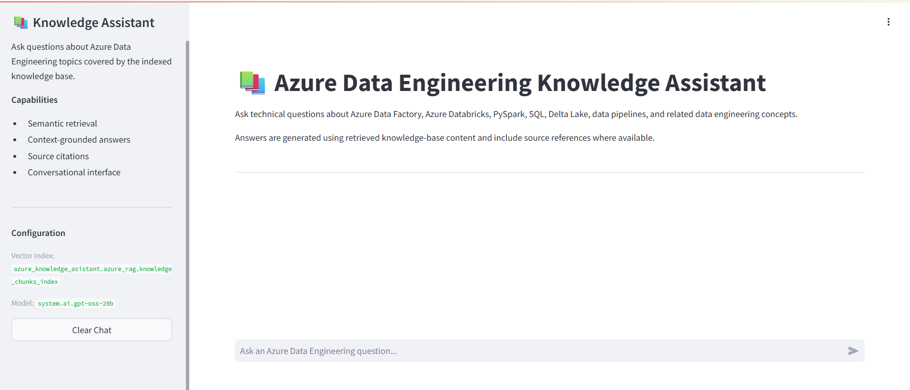
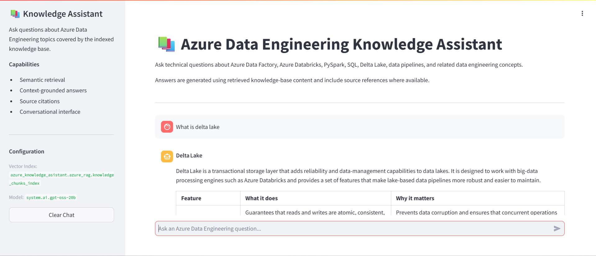
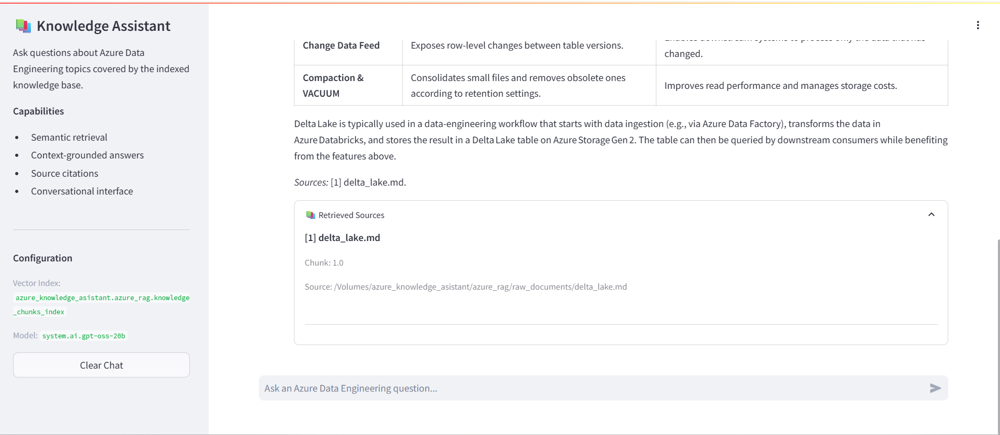
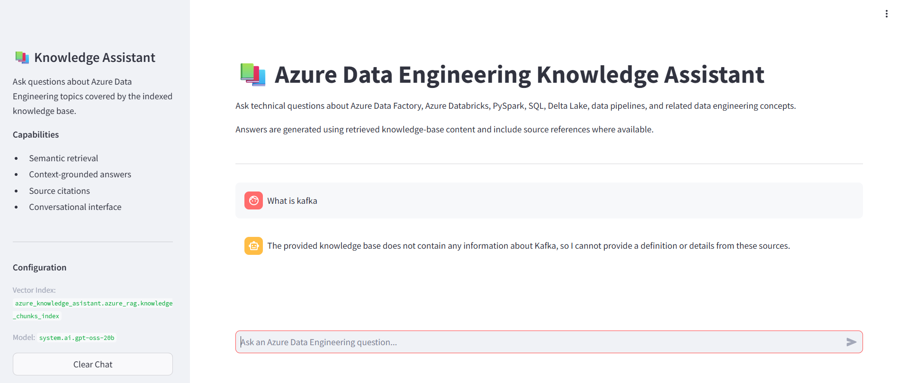

# Application Screenshots

## Overview

This directory contains screenshots captured from the deployed Azure Data Engineering Knowledge Assistant.

The screenshots demonstrate the application's user interface, question-answering workflow, retrieved context, and source citation behavior.

## Screenshot Gallery

Add the actual screenshots captured from the deployed Databricks App.

### 1. Application Interface

**File:** `chatbot_home.png`

Shows the main chatbot interface and question input area.

### 2. Question and Answer

**File:** `chatbot_answer.png`

Shows an example technical question and the generated response.

### 3. Source Citations

**File:** `source_citations.png`

Demonstrates how retrieved source references are displayed alongside the generated answer.

### 4. Retrieved Context

**File:** `retrieved_context.png`

Shows the supporting context retrieved from the knowledge base.

### 5. Out-of-Scope Question

**File:** `out_of_scope.png`

Demonstrates the application's behavior when a question cannot be adequately answered using the available knowledge base.

